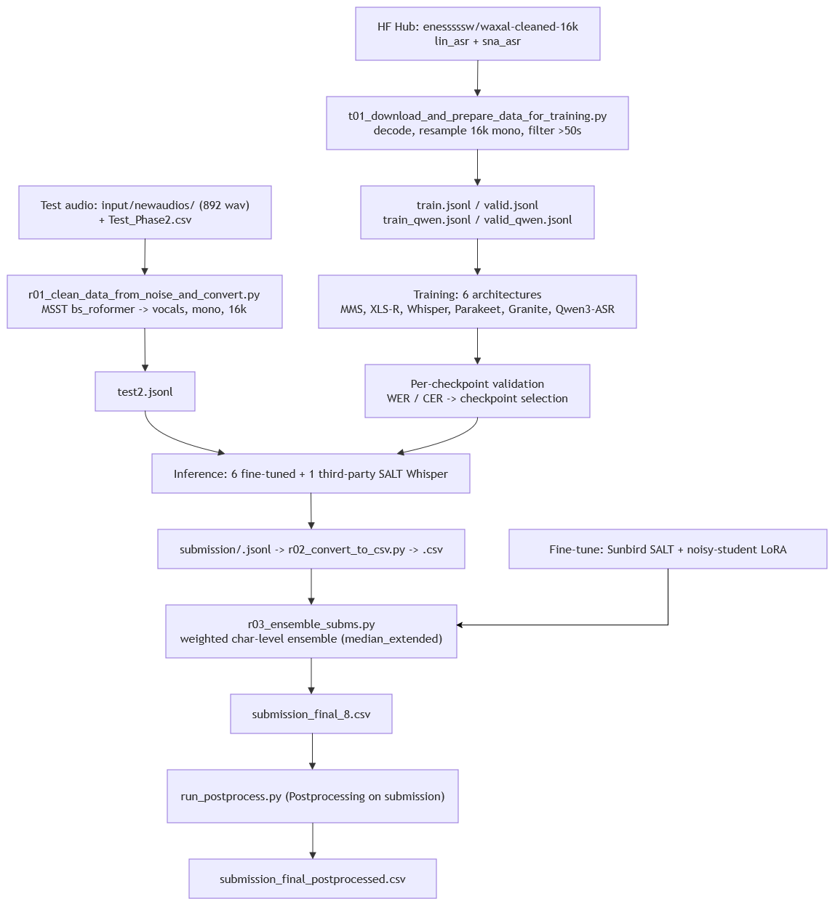

# Google WAXAL ASR Challenge - Solution Documentation (1st place)

**Author:** Team Pasketti (ZFTurbo + enes3774)  
**Competition:** Google WAXAL ASR Challenge (Zindi)  
**Final rank:** 1st place  
**Date:** 10.08.2026  
**Repository:** `Google_WAXAL_ASR_Challenge_final_code`

## Table of Contents

- [1. Overview and objectives](#1-overview-and-objectives)
- [2. Architecture diagram](#2-architecture-diagram)
- [3. ETL process](#3-etl-process)
- [4. Data modeling](#4-data-modeling)
- [5. Inference](#5-inference)
- [6. Run time](#6-run-time)
- [7. Performance metrics](#7-performance-metrics)
- [8. Error handling and logging](#8-error-handling-and-logging)
- [9. Maintenance and monitoring](#9-maintenance-and-monitoring)
- [10. Notes, known issues and reproduction](#10-notes-known-issues-and-reproduction)

## 1. Overview and objectives

### 1.1 Problem

The task was to build an automatic speech recognition (ASR) system on top of the WAXAL dataset that generalises to previously unseen speech. WAXAL is a large open speech resource for African languages, developed by Google Research together with African academic and community organisations, covering 27 languages and thousands of hours of speech. Most African languages remain heavily under-resourced in mainstream ASR systems, and this competition targets exactly that gap.

The competition scope covered three languages - Lingala (`lin`), Shona (`sna`) and Luganda (`lug`). The final (phase 2) test set contained only two of them: Lingala and Shona, so the production solution was trained for these two languages. The pipeline is language-agnostic: adding a language means adding one entry to a list (see Section 10.2).

### 1.2 Evaluation metric

Submissions were scored with a weighted mean of two error rates, each with weight 0.5:

    displayed score = 1 − 0.5 × (WER + CER)

Higher is better for the displayed leaderboard score (equivalently, the underlying mean error is lower-is-better). The combination deliberately balances word-level accuracy against character-level robustness, which matters a lot for African languages where orthography and word segmentation vary between annotators.

### 1.3 Solution in one paragraph

The solution is an ensemble of eight ASR systems: six large pretrained speech models fine-tuned on the WAXAL Lingala + Shona data, plus one third-party African-language Whisper checkpoint used zero-shot and a noisy-student LoRA adaptation of that same checkpoint. The six fine-tuned models were deliberately chosen from different architecture families - CTC encoders, an encoder-decoder seq2seq model, an RNN-T/TDT transducer, and two speech-LLMs - so that their errors are as uncorrelated as possible. Their hypotheses are merged by a character-level weighted voting ensemble. The median output is then passed through an orthography-aware consensus projection: language-structured boundary rules calibrate Lingala and Shona writing conventions, correlated checkpoints propose possible off-manifold repairs, and architecturally diverse systems verify them. This preserves the ensemble by default while removing a small set of high-confidence word-level errors.

### 1.4 Objectives and expected outcomes

| Objective                                            | Outcome                                                                                |
|------------------------------------------------------|----------------------------------------------------------------------------------------|
| Beat the baseline on the 0.5×WER + 0.5×CER metric    | Achieved - 1st place                                                                   |
| Robustness to unseen speakers / recording conditions | Addressed via architectural diversity + ensembling, not per-speaker tuning             |
| Reproducibility on a single GPU                      | Whole pipeline runs on one 96 GB GPU; smaller GPUs work with reduced batch sizes       |
| Reusability by the hosts                             | Every stage is a standalone script; manifests are plain JSONL; no proprietary services |

## 2. Architecture diagram



## 3. ETL process

### 3.1 Extract

**Training data**

| Property      | Value                                                                                            |
|---------------|--------------------------------------------------------------------------------------------------|
| Source        | HuggingFace Hub dataset `enesssssw/waxal-cleaned-16k`                                  |
| Configs used  | `lin_asr` (Lingala), `sna_asr` (Shona)                                                           |
| Splits        | `train`, `validation`, `test`                                                                    |
| Native format | HF `Audio` feature (decoded numpy array + sampling rate) + `transcription` string                |
| Access method | `datasets.load_dataset(...)`, cached under `proc_data/local_models_cache/` via `HF_HOME` |
| Frequency     | One-off. The dataset is static; re-extraction is only needed when WAXAL is updated               |

The script also contains the full list of the other 17 WAXAL language configs (`lug_asr`, `ach_asr`, `aka_asr`, `amh_asr`, …) behind an `if 0:` guard, so extending to the full 19-language set is a one-line change.

**Test data**

| Property   | Value                                                                                           |
|------------|-------------------------------------------------------------------------------------------------|
| Source     | Competition-provided archive, unzipped to `./input/newaudios/`                              |
| Volume     | 892 `.wav` files                                                                                |
| Index file | `./input/Test_Phase2.csv` - provides the canonical `ID` column and row order for the submission |

**Third-party model weights (extracted at inference time)**

- MSST separation weights: `bs_6stem_fixed.ckpt` + `bs_6stem_fixed_config.yaml` (`noblebarkrr/mvsepless_resources`), placed in `msst/`.
- `Sunbird/asr-whisper-51-african-languages` - **gated repo**; requires an approved access request plus a HuggingFace token passed on the command line.

### 3.2 Transform

**Training branch** (`proc_data/t01_download_and_preapre_data_for_training.py`)

1.  **Materialise audio to disk.** Each HF sample is decoded and written as an individual WAV file under `input/dataset_cleaned/{lang}_asr/{split}/`. Reading raw files is much faster than re-decoding HF Arrow shards on every epoch, and it lets all six training frameworks (HF Trainer, NeMo, Lightning) consume the *same* data.
2.  **Resample to 16 kHz** if the source rate differs. All six backbones expect 16 kHz.
3.  **Write a per-split** `markdown.jsonl` with `id`, `audio`, `text`, `duration`. The step is idempotent - if `markdown.jsonl` already exists the split is skipped.
4.  **Build the training manifest** (`gen_training_data`): concatenates the `train` and `validation` splits of both languages, **drops any clip longer than 50 seconds** (memory safety and a hard limit for the transducer / speech-LLM models), and emits `input/train.jsonl` with absolute POSIX-normalised paths.
5.  **Build the validation manifest** (`gen_valid_data`): drawn from the held-out `test` split, shuffled, **capped at 100 utterances per language** (200 total). The cap is deliberate - validation runs after *every* checkpoint save, so it has to be cheap. This manifest additionally carries `id` and `lang`.
6.  **Emit Qwen-format copies** (`convert_for_qwen`): `train_qwen.jsonl` / `valid_qwen.jsonl` with just `{audio, text}`, which is what the Qwen3-ASR training loader expects.

**Inference branch** (`proc_data/r01_clean_data_from_noise_and_convert.py`)

1.  **Speech enhancement / de-noising.** The full test folder is run through [MSST](https://github.com/ZFTurbo/Music-Source-Separation-Training) with a `bs_roformer` 6-stem model, and only the `vocals` stem is retained. This removes background music and non-speech noise.
2.  **Channel reduction**: the separated stereo output is averaged to mono.
3.  **Resample to 16 kHz** using `librosa` with `res_type='soxr_vhq'` (highest-quality SoXR kernel - chosen because cheap resamplers introduce aliasing that CTC models are measurably sensitive to). Written as 32-bit float WAV.
4.  **Manifest generation** (`gen_test_phase_2_data_json`): produces `input/test2.jsonl` with `id`, `audio_filepath`, empty `lang`/`text` placeholders and, importantly, `duration` - the field that drives dynamic batching at inference (Section 5.2). The script hard-fails if any file is not 16 kHz after conversion.

> **Note for the hosts:** the de-noising stage was developed during phase 1, when the test audio was noisy. The final phase-2 test set turned out to be clean, so this step is **most likely unnecessary** for data of similar quality and can be skipped by pointing `test2.jsonl` at the raw (mono, 16 kHz) audio. It is kept in the pipeline for exact reproducibility of the winning submission.

**Text transformation.** Deliberately minimal. There is **no** transcript normalisation, lowercasing or punctuation stripping in the training path - the metric is computed on raw text, so any normalisation would only lose information. The only text-side constraint is the CTC character vocabulary (Section 4.2). A `normalizer/` package (Whisper-style English and basic multilingual normalisers) is included and used only for *diagnostic* metric comparisons, never in the submission path.

**Sample-level filtering.**

| Filter                                      | Where                                     | Rationale                                                                                                                                                                                                                                     |
|---------------------------------------------|-------------------------------------------|-----------------------------------------------------------------------------------------------------------------------------------------------------------------------------------------------------------------------------------------------|
| `duration > 50 s` dropped                   | `t01_…py`                               | Memory ceiling; extreme outliers                                                                                                                                                                                                              |
| `duration > 60 s` dropped                   | Granite training (`--max-duration`) | Speech-LLM context limit                                                                                                                                                                                                                      |
| `duration > 16 s` dropped                   | Parakeet training (`max_duration`)        | Transducer training stability                                                                                                                                                                                                                 |
| Empty transcripts dropped                   | Granite training                          | Would produce degenerate targets                                                                                                                                                                                                              |
| `input_len // 320 <= label_len` dropped | MMS + XLS-R training                      | **CTC validity.** Wav2Vec2 downsamples audio 320×; if the number of output timesteps does not exceed the label length, CTC loss is `inf` and gradients become `NaN`. This filter is the single most important stability fix in the CTC branch |

### 3.3 Load

There is no database in this pipeline - deliberately. The storage layer is:

- **Flat 16 kHz mono WAV files** on local disk (`input/dataset_cleaned/…`, `input/newaudios_cleaned_mono/`).
- **JSONL manifests** in NeMo manifest style (`audio_filepath`, `text`, `duration`, plus `id`/`lang` where relevant). This one format is consumed natively by NeMo, and is trivially wrapped into a `datasets.Dataset` for the HuggingFace models.

Design rationale and optimisations:

- `duration` **is precomputed and stored in the manifest.** This is the key indexing decision: it lets both training and inference sort and bucket by length *without touching the audio*, which is what makes dynamic batching (Section 5.2) and NeMo bucketing possible at zero I/O cost.
- **Audio is loaded on the fly inside the collator**, never preloaded into RAM. Peak memory stays flat regardless of dataset size, and audio decoding is parallelised across 4–8 dataloader workers.
- **Absolute, forward-slash-normalised paths** are written into the manifests so the same manifest works under Linux and WSL2.
- **Model artefacts** live under `model_*/models/<checkpoint-name>/`, where the directory name itself encodes the validation scores (e.g. `checkpoint-12450_cer_0.0767_wer_0.3252`) - see Section 8.
- **HuggingFace cache** is redirected per-model via `HF_HOME` so downloads are local to the project and reproducible.

## 4. Data modeling

### 4.1 Modelling assumptions

1.  **Transfer learning beats training from scratch.** WAXAL is large by African-language standards but small compared to what modern ASR backbones were pretrained on. Every model here is a fine-tune of a large multilingual pretrained checkpoint.
2.  **Architectural diversity is the main source of ensemble gain.** CTC, seq2seq, transducer and speech-LLM decoders fail in structurally different ways: CTC models drop/merge characters, seq2seq models hallucinate and loop, transducers are conservative. Averaging over these failure modes is far more effective than averaging over seeds of one architecture.
3.  **Per-language models are unnecessary.** A single multilingual model per architecture, trained on both languages jointly, was used. The languages share Latin orthography and the joint model benefits from positive transfer.
4.  **No language model rescoring.** A KenLM decoder hook is present in the MMS inference code but left disabled - there is no large clean text corpus for Lingala/Shona that would justify it, and the ensemble already recovers most word-level errors.

### 4.2 Feature engineering and normalisation

Feature extraction is entirely delegated to each model’s own processor, which is the correct choice - mismatched front-ends are a classic source of silent degradation:

| Model               | Front-end                                                                                               |
|---------------------|---------------------------------------------------------------------------------------------------------|
| MMS-1B / XLS-R-300M | Raw waveform, `Wav2Vec2FeatureExtractor`, `do_normalize=True` (per-utterance zero-mean/unit-variance) |
| Whisper large-v3    | 128-bin log-Mel, 30 s fixed window (`padding="max_length"`)                                         |
| Parakeet TDT        | NeMo default log-Mel front-end from the model config                                                    |
| Granite Speech      | `GraniteSpeechProcessor` mel front-end + audio projector                                                |
| Qwen3-ASR           | `Qwen3ASRProcessor` front-end + `normalize_audios`, long audio split via `split_audio_into_chunks`      |

**Output vocabulary (CTC models only).** A fixed 107-symbol character vocabulary was defined by hand (`VALID_CHARS`), covering the Latin alphabet in both cases, digits-free punctuation, and the accented characters that actually occur in the Lingala/Shona transcripts (`é è í ô à ñ â ú ê ï ç ó ì á ù ò û ā ĺ ķ Ķ Ĺ œ Œ þ ĝ « » “ ”` …), plus `[UNK]`, `[PAD]` and `|` as the word delimiter. Sorting is deterministic, so the vocab is byte-identical across runs. Spaces are mapped to `|` at label-encoding time.

The seq2seq and speech-LLM models keep their native pretrained tokenizers unchanged.

### 4.3 Models, training procedure and hyperparameters

All training ran on **a single NVIDIA A6000 Blackwell 96 GB** in `bf16`.

#### Model 1 - `facebook/mms-1b-all` (CTC) - `model_facebook_mms/`

Massively Multilingual Speech, 1B params, already pretrained on 1000+ languages, which makes it the strongest single starting point for this task. Trained in **two stages**:

|                    | Stage 1 - `adapter`                                                                                       | Stage 2 - `full`                                                     |
|--------------------|-----------------------------------------------------------------------------------------------------------|----------------------------------------------------------------------|
| Init from          | `facebook/mms-1b-all`                                                                           | stage-1 output                                                       |
| Trainable          | Adapter layers + `lm_head` only (base frozen via `freeze_base_model()`, then `init_adapter_layers()`) | Everything except the feature encoder (`freeze_feature_encoder()`) |
| LR                 | `1e-3`                                                                                                | `1e-5`                                                           |
| Epochs             | 4                                                                                                         | 10                                                                   |
| Batch × grad-accum | 4 × 6 (eff. 24)                                                                                           | 12 × 2 (eff. 24)                                                     |
| Eval / save every  | 3000 steps                                                                                                | 1000 steps                                                           |

Common: `linear` schedule, 500 warmup steps, `max_grad_norm=1.0`, all dropouts and `layerdrop` set to **0.0**, `ctc_loss_reduction="mean"`, `ctc_zero_infinity=True`, gradient checkpointing on, `save_total_limit=15`.

*Why two stages:* training a 1B-parameter model directly at a normal LR on ~tens of hours of data destroys the pretrained representation. Learning the adapters + output head first at a high LR aligns the new character vocabulary with the frozen encoder; only then is the whole stack unfrozen at a 100× lower LR.

*Inference decoding:* CTC beam search via `pyctcdecode` (`build_ctcdecoder`) with **beam width 5000**, no LM. Beam width was tuned on validation - the gain saturates quickly (see Section 7.3).

#### Model 2 - `facebook/wav2vec2-xls-r-300m` (CTC) - `model_wav2vec/`

The smaller, purely self-supervised multilingual cousin of MMS. Same vocabulary, same collator, same CTC filter - different pretraining objective, and therefore different errors, which is exactly what the ensemble needs.

`lr=2e-5`, 20 epochs, batch 5 × grad-accum 2, `weight_decay=0.01`, 500 warmup steps, linear schedule, bf16, eval/save every 3000 steps, `load_best_model_at_end=True` on CER. Inference uses greedy CTC argmax decoding.

#### Model 3 - `openai/whisper-large-v3` (encoder–decoder) - `model_whisper/`

Full fine-tune of the 1.5B seq2seq model. `forced_decoder_ids=None` and `suppress_tokens=[]` are cleared so the decoder is free to emit whatever the fine-tuned data requires (the processor is instantiated with `language="english", task="transcribe"` purely as a stable prompt prefix - the target languages are not in Whisper’s language inventory, so the tag is a fixed placeholder rather than a semantic claim).

`lr=1e-5`, 20 epochs, batch 8, `linear` schedule, 500 warmup, bf16 + tf32, `predict_with_generate=True`, `generation_max_length=225`, eval/save every 3000 steps, `load_best_model_at_end=True` on CER.

*Inference:* fp16, `num_beams=5`, `max_new_tokens=428`, `return_timestamps=False`.

#### Model 4 - `nvidia/parakeet-tdt-0.6b-v3` (TDT / RNN-T transducer) - `model_parakeet/`

The only transducer in the ensemble, trained through the NeMo + Lightning stack. Two stages, mirroring the MMS strategy:

- `adapter`: encoder frozen (`requires_grad=False`), decoder + joint trainable.
- `full`: restored from the stage-1 `.nemo` file, everything trainable.

Data config: `max_duration=16.0`, `min_duration=0.1`, batch 4, **bucketing enabled with 6 buckets**, 8 workers, `min_tps=0` / `max_tps=1000` (token-per-second guards disabled because African-language transcripts fall outside NeMo’s default English-tuned range and would otherwise be silently discarded).

Optimisation: `lr=5e-5`, `min_lr=5e-6`, `accumulate_grad_batches=2`, `gradient_clip_val=1.0`, `bf16-mixed`, up to 100 epochs with validation every 1321 steps and `ModelCheckpoint(monitor="val_wer", save_top_k=15)`.

Two implementation details worth flagging to the hosts:

- **CUDA graph decoding is explicitly disabled** (`kill_cuda_graphs`, `use_cuda_graph_decoder=False`, `loop_labels=True`). CUDA-graph capture in the greedy transducer decoder is fragile under WSL2 and during in-training validation; disabling it costs a little speed and removes a whole class of crashes. `export NUMBA_CUDA_USE_NVIDIA_BINDING=1` also helps under WSL2.
- **Automatic resume**: the script scans `parakeet_checkpoints/*.ckpt` and resumes from the most recent one, so an interrupted long run can simply be restarted.

**Checkpoint averaging** was applied for the final Parakeet model - averaging the top 7 checkpoints (`averaged_parakeet_7.nemo`) improved validation over the single best checkpoint (WER 0.4013 → 0.3965, CER 0.1168 → 0.1129).

#### Model 5 - `ibm-granite/granite-speech-4.1-2b` (speech-LLM) - `model_ibm_granite/`

An audio encoder + projector + LLM decoder. Prompted with:

    <|audio|>transcribe the speech with proper punctuation and capitalization.

wrapped in the model’s chat template with `add_generation_prompt=True`.

*Selective unfreezing* (`should_train`): the **audio projector, all LoRA parameters and** `lm_head` **are always trainable**; on top of that the **last N LLM layers** are unfrozen (`--train-last-n-layers`, default 10). The custom collator left-pads the prompt and right-pads the target, and masks the prompt region with `-100` so **loss is computed on the transcription only**.

`lr=1e-5`, cosine schedule, `warmup_ratio=0.03`, batch 4 × grad-accum 4, 10 epochs, `max_duration=60 s`, bf16, `data_seed=42`, save every 1000 steps.

An optional **second pass** is documented in the README: restart from the best checkpoint with `--train-last-n-layers 60`, which (because `--model-name` is no longer the base model) unfreezes *all* parameters.

*Inference:* `num_beams=3`, `max_new_tokens=1024`, greedy sampling off.

#### Model 6 - `Qwen/Qwen3-ASR-1.7B` (speech-LLM) - `model_qwen3_asr/`

The second speech-LLM, with a different audio tower and a different tokenizer. Trained **fully unfrozen** - a `freeze_qwen3_asr_exact()` helper is provided (unfreeze the last K audio-tower layers, the last M LLM layers, `proj1`/`proj2`, `model.norm`, `lm_head`) but full fine-tuning validated better and the call is commented out.

Prompt construction is prefix-only: a system message plus a user turn containing the audio token; the target text plus EOS is appended, and **every token of the prefix is masked to** `-100`, as are all pad tokens.

`lr=1e-5`, linear schedule, `warmup_ratio=0.02`, batch 6 × grad-accum 2, 10 epochs, bf16, save every 1000 steps, `save_safetensors=True`, resume support via `--resume` / `--resume_from`.

Two engineering patches are needed for this model and are worth calling out:

- `patch_outer_forward()` rewrites the wrapper’s `forward` to delegate to `model.thinker.forward` with a `labels` argument - the released wrapper is inference-oriented and does not expose a training-compatible forward.
- `CastFloatInputsTrainer` overrides `_prepare_inputs` to cast every floating-point tensor to the model dtype, preventing fp32/bf16 mismatches inside the audio tower.
- `MakeEveryCheckpointInferableCallback` copies the tokenizer/processor/chat-template JSON files from the base model into every saved checkpoint, so each checkpoint is self-contained and directly loadable.

*Inference:* long audio is split by `split_audio_into_chunks` at the model’s `MAX_ASR_INPUT_SECONDS` limit and re-joined; `num_beams=5`, `do_sample=False`, `max_new_tokens = min(20 × duration_sec, MAX_ASR_INPUT_SECONDS × 20)` - i.e. the token budget is derived from audio length rather than fixed, which prevents both truncation on long clips and runaway generation on short ones. Any `<asr_text>` control marker is stripped from the output.

#### Model 7 - `Sunbird/asr-whisper-51-african-languages` (third party, zero-shot)

Not trained. A Whisper large-v3 derivative covering 51 African languages, from the SALT project. Used purely for hypothesis diversity - it was trained on data this solution never saw.

The interesting detail: this checkpoint **re-purposes unused Whisper language tokens** to address African languages (the `LANGUAGE_TOKENS_WHISPER` map: `sna` → 50324, `lin` → 50353, `lug` → 50332, and ~40 overwritten slots). Decoding is driven by explicit `forced_decoder_ids` - `(1, lang_token), (2, <|transcribe|>), (3, <|notimestamps|>)`.

> **Explicit note for the hosts:** the forced language token in the shipped script is `LANGUAGE_NAMES['Runyankole']` (`cgg` → 50350), **not** Lingala or Shona. This was not an oversight - forcing a “wrong” but related token was empirically better on validation than forcing the nominally correct one, and this model contributes the highest-weighted hypothesis in the ensemble. It is nevertheless the most surprising line in the codebase and the first thing to re-tune if the language set changes.

*Requires:* approved access to the gated repo + a HF token passed as `argv[1]`.

#### Model 8 - Sunbird SALT + noisy-student LoRA

The same checkpoint as Model 7, adapted with a LoRA trained on its own pseudo-labels. The two members are architecturally identical and differ only in what they have been made robust to, which is why both carry weight 10.0 rather than one replacing the other. Contributed independently and trained on separate hardware; code in model_whisper_salt_student/.

Rationale. The base is already trained on Google WAXAL including lin and sna, so there is little new to teach it and a lot to forget - a full fine-tune of a Sunbird Whisper was tried and collapsed, WER 0.3302 to 0.4172 in 3k steps. The student is therefore not taught new words. It is taught robustness to unheard voices, which is the measured failure mode: the evaluation set is entirely new speakers, and WAXAL holds only 90 distinct Lingala speakers and 160 Shona. No quantity of additional WAXAL audio adds speakers, so augmentation manufactures them.

Targets. The labels come from Whisper, never from WAXAL's transcribers. WAXAL writes namoni 3983 times against na moni 1359, while the evaluation references split roughly 73% of the time, so a student fitted to WAXAL text inherits a house style that is backwards for the test set. The teacher decodes the WAXAL train audio at beam 5 keeping 5-best; AfriqueQwen-14B rescores the n-best lists (lin 0.01, sna 0.3, word bonus 0.04); hypotheses over 20 characters per second are dropped as repetition loops and clips over 29s are dropped because the feature extractor truncates them silently. The confirmed orthographic splits are then applied to the labels, so the student produces the scoring-optimal convention natively rather than being corrected afterwards.

Training signal. The teacher reads clean audio; the student reads augmented audio and must still produce the teacher's transcript. That asymmetry is the entire gradient - an earlier attempt on this project pseudo-labelled 313k chunks with a same-architecture teacher and no augmentation, and the student learned nothing, because it could already reproduce the labels. Augmentation is weighted toward speaker identity: speed perturbation without pitch correction at p=0.7 (0.9/1.0/1.1), pitch shift at p=0.3 (0.95-1.05), SpecAugment always (2 frequency masks up to 20, 2 time masks up to 40). Additive noise (p=0.2, SNR 15-30 dB) and reverb (p=0.15) are deliberately small; they simulate a channel shift for which there is no evidence.

Setup. LoRA r=16, alpha=32, dropout 0.05 on q_proj/k_proj/v_proj/out_proj, matched by name suffix so the adapters reach encoder self-attention as well as the decoder - 128 encoder and 256 decoder adapters over 384 attention projections, 15,728,640 trainable parameters of 1,559,219,200 (1.01%). lr 1e-5 with a OneCycle schedule, batch 8 x grad-accum 4, bf16, gradient checkpointing, 2000 steps, checkpoint every 500. Data: 23,080 pseudo-labels over 228 speakers, 15 speakers held out, leaving 22,608 train and 472 eval clips. The encoder is the point: speaker identity is acoustic, so a decoder-only adapter cannot learn invariance to it - an earlier decoder-only LoRA scored 0.7459 against base Whisper's 0.7455, no acoustic gain, and it narrowed the candidate pool from 4.70 to 4.63 distinct hypotheses of 5, which cost the rescoring stage downstream.

Checkpoint selection. The shipped adapter is step 500 of the 2000-step run. Step 1000 was worse and step 2000 worse still. 500 steps at 32 samples is 16,000 samples, about 0.7 of one epoch - the labelled data running out rather than the method saturating, since teacher and student saw the same 23,080 clips, a 1:1 ratio where the noisy-student literature runs closer to 230:1. Holdout is by speaker, not by clip: clip-level holdout measures memorisation of voices already trained on, the mistake WAXAL's own validation split makes, where 64 of its 65 Lingala speakers also appear in train.

Inference. Beam 5 keeping 5-best, then AfriqueQwen-14B rescoring and shallow fusion, then capitalisation and a sentence-final stop. Beam width was measured: beam 1 to 5 was worth +0.007, larger than any single postprocessing rule found on this project, and 10-best measured -0.022, so 5 is the peak. The LLM never proposes text, only re-ranks what the beam produced, which makes the n-best oracle a hard ceiling on the stage; it captures about 13% of it. Unlike Model 7 this member forces the correct language token per clip (lin to `<|ln|>`, sna to `<|sn|>`) - the deliberate mismatch that helps the zero-shot checkpoint does not transfer, because the adapter was trained with the correct tokens in the prompt.

> Note for the hosts: use_reentrant=False in gradient_checkpointing_enable is a correctness requirement here, not a preference. Whisper's encoder is fed convolutional features rather than embeddings, so nothing at its input requires grad, and the reentrant checkpoint implementation then prunes the encoder from the backward graph - every encoder LoRA adapter receives no gradient. Measured on this model: reentrant gives 0 encoder parameters with a gradient, non-reentrant gives 128. The decoder trains normally either way, so the loss curve looks healthy while the only part that can learn speaker invariance sits frozen. run_training.py asserts on the encoder adapter count for this reason, because PEFT matches by name suffix and a wrong module list fails silently.

### 4.4 Validation strategy

- **Holdout, not cross-validation.** Validation uses the `test` split of the source dataset - data never seen in training - sub-sampled to **100 utterances per language (200 total)**. K-fold was not used: with six large models to fine-tune on one GPU, the compute cost of K-fold would have been prohibitive, and the holdout is drawn from a genuinely separate split rather than a random slice of the training pool.
- **Validation runs after every checkpoint save**, through a `TrainerCallback` (`ValidCheckpointCallback`) present in every training script. It calls the model’s `run_validation.py`, computes WER and CER with the HuggingFace `evaluate` library, and **renames the checkpoint directory to embed the scores**, e.g. `checkpoint-12450` → `checkpoint-12450_cer_0.0767_wer_0.3252`.
- **Checkpoint selection is manual and score-driven**: the operator picks the best directory by the name, and hard-codes it in `run_inference.py`. This is simple and fully transparent, at the cost of not being automated (see Section 10.3).
- **Metric parity with the leaderboard.** WER and CER are computed on **raw, unnormalised text**, exactly as the competition scores them. A normalising variant exists in `model_qwen3_asr/run_inference.py::calc_metrics` for diagnostics only; empty references are substituted with a placeholder character there to avoid a division-by-zero in the WER implementation.
- **Ensemble weights were tuned on the same validation set**, guided by individual model scores.

### 4.5 The ensemble

`proc_data/r03_ensemble_subms.py`, using `asr-ensemble==1.0.2`:

    ensemble_text_lists(
        texts_list,
        normalize=False,
        char_level=True,
        weights=weights,
        ensemble_type='median_extended',
        language=None,
        max_workers=8,
    )

This is a weighted voting scheme operating at character level: hypotheses are aligned to each other, and at each alignment slot the character with the highest accumulated weight wins. Character level (rather than word level) was chosen deliberately - for Lingala and Shona, word boundaries and agglutinative spellings differ between systems, so word-level alignment fragments; character-level alignment is far more robust and directly optimises the CER half of the metric.

Final weights:

| \#  | Source file                             | Weight |
|-----|-----------------------------------------|--------|
| 1   | `submission_whisper_salt.csv`           | 10.0   |
| 2   | `submission_facebook_mms.csv`           | 12.0   |
| 3   | `submission_wav2vec.csv`                | 11.0   |
| 4   | `submission_whisper.csv`                | 9.0    |
| 5   | `submission_qwen.csv`                   | 6.0    |
| 6   | `submission_parakeet.csv`               | 4.0    |
| 7   | `submission_ibm_granite.csv`            | 4.0    |
| 8   | `submission_whisper_salt_student.csv` | 10.0   |

> Weight ordering otherwise tracks individual validation quality (MMS \> XLS-R \> Whisper \> Qwen \> Parakeet ≈ Granite

Safety checks in the ensembler: all inputs are sorted by `ID` and the ID tuples are compared across files - a mismatch aborts the run rather than silently producing misaligned output; `NaN` targets are filled with the empty string; final texts are stripped.

### 4.6 Orthography-aware consensus projection

#### Motivation

The weighted character median is intentionally an unconstrained estimator in string space. That freedom is useful: it can reconstruct the correct character sequence even when no individual recogniser produced the complete word, and it is a major reason the ensemble has strong CER. Its corresponding failure mode is local rather than semantic: an alignment can occasionally splice neighbouring fragments into a token that is close to several hypotheses but is not a stable orthographic unit. Word boundaries are especially exposed because the systems learned different conventions for Lingala and Shona.

We treated this as a constrained consensus problem, not as text correction. The median remains the default output. Postprocessing is allowed to modify it only through language-structured boundary transformations or through an alternative that an acoustic model emitted for the same clip and that independent systems verify. No reference transcript, free-form language model, or manual row rewrite is used.

#### Language-structured boundaries

A language-ID map routes each utterance to Lingala or Shona before applying orthographic rules. The rules operate on grammatical classes rather than arbitrary vocabulary lists. In Lingala, the pipeline separates recurrent function-word constructions such as namoni → na moni and nazo mona, uses WAXAL counts to identify plausible ba/bazo/baza boundaries, and then protects the conjugated-verb family by rejoining bazali, batie, balati, bakomi, bafandi, bavandi, basali, batelemi and balakisi. It also separates the frequent na + function-word family (na ye, na nga, na kati, na se, na yango, na ba, na biso).

For Shona, the main distinction is between morphology internal to a word and an auxiliary followed by a ku- infinitive. The latter is written as two orthographic words in the target convention, for example varikufamba → vari kufamba and arikuratidza → ari kuratidza. A high-frequency WAXAL table handles common forms and a restricted ri + ku pattern covers rare forms. The restriction is important: it does not split arbitrary agglutinative Shona words. A residual pass catches seven progressive forms whose subject prefixes fall outside the narrower first pattern.

Two further deterministic passes complete the calibration. The Lingala function-word family has a third member, tozomona -> tozo mona, which fires 20 times against 208 for namoni and 126 for nazomona. And every utterance is finally capitalised on its first alphabetic character and closed with a full stop unless it already ends in one. That last step is not cosmetic: it applies to all 892 rows and measured about +0.004 on the leaderboard on its own, which makes it the largest single deterministic effect in this section. A reimplementation that follows only the boundary rules above would emit lowercase, unpunctuated text and lose it.

Two lexical rules also ship and are dormant on this submission, firing zero times: a single WAXAL-frequency spelling normalisation (bhurawuni -> bhurauni, written 644 to 349 in the corpus) and a guard that strips a degenerate repeated tail from a hypothesis. Neither is a boundary transformation nor an acoustically verified alternative, so the constraint stated above is more precisely: the median is modified only through language-structured boundary transformations, corpus-frequency orthographic normalisation such as casing, sentence-final punctuation and that one spelling pair, or an alternative that an acoustic model emitted for the same clip and that independent systems verify. No reference transcript, free-form language model output, or manual row rewrite is used at any stage.

#### Proposal and independent verification

After boundary calibration, the pipeline looks for possible off-manifold tokens. Candidate generation deliberately has high recall. A strict ghost proposal starts from a token absent from WAXAL and unsupported by the proposal-member vocabulary, then searches for a one-edit alternative emitted for the same clip with at least five votes. A second proposal rule admits an OOV token supported by a minority, but requires a one-edit alternative with at least four votes and a margin of two.

The proposal systems include several checkpoints from related training runs. Their correlation is useful for detecting recurring alternatives but makes their raw vote count over-confident. Therefore no proposal is accepted at this stage. A separate verifier uses six architecturally diverse ASR systems. Strict proposals survive only when the diverse systems favor the replacement; relaxed proposals require at least three diverse votes and a margin of two. This detector/verifier separation is analogous to using a high-recall proposal model followed by an independent precision filter.

| Stage                    | Fixed criterion                                      | Proposed      | Retained          |
|--------------------------|------------------------------------------------------|---------------|-------------------|
| Orthographic calibration | Language-routed grammatical boundaries               | Deterministic | All matched rules |
| Strict ghost repair      | OOV + no proposal-member support + same-clip witness | 24            | 21                |
| Relaxed non-word repair  | OOV + one-edit local majority                        | 118           | 20                |
| Diverse verification     | Independent acoustic vote thresholds                 | 142 total     | 41 token repairs  |

#### Why the verifier matters

An audit of the 118 relaxed proposals demonstrates the effect of correlation. The local checkpoint pool strongly favored the proposed replacements (873 votes versus 183 for the originals), but the six diverse systems were almost perfectly balanced: 47 proposals favored, 47 originals favored and 24 ties, with 256 total votes for replacements versus 268 for originals. Directly applying the local majority would therefore have converted checkpoint correlation into transcription errors. The verifier rejected 98 of those 118 proposals.

#### Winning configuration and reproducibility

The final layer changed 41 tokens across 39 of 892 utterances. The complete Stage2_8 ensemble plus this postprocessor produced the winning submission: public score 0.769614172 (CER 0.104677677, WER 0.356093977) and private score 0.780944419 (CER 0.109050328, WER 0.329060831). Because the clean Stage2_8 ensemble was not submitted separately after all boundary rules, these figures validate the complete system rather than assigning a causal delta to each individual stage.

All member prediction CSVs, language routing, WAXAL frequency sources and the raw weighted ensemble are included under postprocess/artifacts/. The one-command runner validates schema, ID order, duplicate IDs and empty targets, emits a decision audit, and can compare the result byte-for-byte with the bundled winning submission.

    python postprocess/run_postprocess.py --verify-reference
    # Expected SHA-256: 9a665cd4b81a0443300b021eec373088a46b2ea9a746dfb826bb1923d434ad31

## 5. Inference

### 5.1 Deployment model

The solution is a batch, offline inference pipeline, not a service. There is no API server, no container orchestration and no cloud dependency beyond downloading model weights. Everything runs from bash on a single machine with one CUDA GPU:

    bash run_inference.sh

which executes, in order: dependency install → de-noise + manifest build → six model inferences → third-party model inference → JSONL→CSV conversion → character ensemble → orthography-aware consensus postprocessing.

Each model runs in its own process, sequentially. This is a deliberate choice: only one set of model weights is resident in GPU memory at a time, so the whole ensemble runs on a single GPU that could not possibly hold all seven models simultaneously. Every inference script ends with `del model; gc.collect(); torch.cuda.empty_cache()`.

### 5.2 Input handling and dynamic batching

New data enters as a folder of WAV files plus a `Test_Phase2.csv` index. After Section 3.2 preprocessing, `test2.jsonl` is the single input contract for all seven models.

Every inference script:

1.  Loads the manifest and sorts utterances by duration, descending. Long clips run first, so if the run is going to OOM, it OOMs in the first minute rather than after an hour.

2.  Builds duration-aware dynamic batches. For the CTC/speech-LLM models the batch size comes from a memory model that accounts for the quadratic cost of attention:

    ```
    batch_size = MEMORY_BUDGET / (duration + ATTENTION_PENALTY * duration²)
    ```

    with `MEMORY_BUDGET = 18`, `ATTENTION_PENALTY = 0.0125`, `MAX_BATCH_SIZE = 8` for MMS; `MEMORY_BUDGET = 250`, `MAX_BATCH_SIZE = 10` for Granite. Clips over 200 s always get `batch_size = 1`. Whisper uses fixed batches (8 for the first 100 long items, then 16) because its input is always padded to a fixed 30 s window, so duration-adaptive sizing buys nothing.

3.  Feeds batches through a `DataLoader` with `batch_size=None`, an identity collate function and 2 prefetching workers - audio decoding overlaps with GPU compute.

4.  Runs the model under `torch.inference_mode()` in bf16 (fp16 for the Whisper family).

### 5.3 Output interpretation

Each model writes `submission/submission_<model>.jsonl` - the input manifest with the `text` field replaced by the hypothesis. A missing prediction defaults to `""` rather than raising, so one bad utterance cannot lose the whole run.

`r02_convert_to_csv.py` then joins these predictions onto `Test_Phase2.csv` by `ID` (`df['Target'] = df['ID'].map(res_pred)`), guaranteeing the row order the competition expects regardless of the order the models processed the audio in. It converts every `.jsonl` it finds in `submission/` in one pass.

r03_ensemble_subms.py produces the intermediate submission/submission_final_8.csv with columns ID,Target. postprocess/run_postprocess.py then applies orthographic calibration and independently verified repair proposals, producing submission/submission_final_postprocessed.csv plus a per-decision audit CSV.

### 5.4 Model updates, versioning and retraining

- **Model versioning is directory-name based.** A checkpoint directory carries its step count and its validation scores in its name (`checkpoint-12450_cer_0.0767_wer_0.3252`), which makes provenance auditable from a file listing alone. Selecting a different version = editing one `model_path` string in `run_inference.py`.
- **Format versioning:** HF models are stored as `safetensors` checkpoints with their processor/tokenizer files co-located (enforced for Qwen by an explicit callback); Parakeet is stored as a single self-contained `.nemo` archive.
- **Retraining strategy:** the six models are independent. New data (new speakers, a new language, corrections) means re-running `t01_…py` to rebuild the manifests, then retraining models individually - there is no need to retrain all six at once, and the ensemble stays functional with a mixture of old and new members.
- **Ensemble maintenance:** adding or removing a member is an edit to the `subm_list` and `weights` arrays. Weights should be re-tuned on validation after any member changes.
- **Resumability:** Parakeet auto-resumes from the newest checkpoint in `parakeet_checkpoints/`; Qwen3-ASR supports `--resume 1` / `--resume_from <path>`. The HF Trainer scripts support `resume_from_checkpoint` (currently behind an `and 0` guard - see Section 10.3).

## 6. Run time

**Hardware used for all measurements:** 1 × NVIDIA A6000 Blackwell 96 GB, Python 3.10, CUDA 12.8, PyTorch 2.11.

### 6.1 ETL

| Script                                                    | Purpose                                                              | Run time |
|-----------------------------------------------------------|----------------------------------------------------------------------|----------|
| `proc_data/t01_download_and_preapre_data_for_training.py` | Download WAXAL (lin+sna), materialise WAVs, build manifests          | ~2 hrs   |
| `proc_data/r01_clean_data_from_noise_and_convert.py`      | MSST separation + mono/16 kHz conversion + `test2.jsonl` (892 files) | ~25 min  |
| `proc_data/r02_convert_to_csv.py`                         | JSONL → CSV (7 files)                                                | \< 5 s   |
| `proc_data/r03_ensemble_subms.py`                         | Weighted char-level voting over 8 hypothesis sets, 8 workers         | ~1 min   |

### 6.2 Training

| Model                  | Stage                        | Config                                                       | Run time                        |
|------------------------|------------------------------|--------------------------------------------------------------|---------------------------------|
| MMS-1B                 | adapter                      | 4 epochs, eff. batch 24                                      | 4 hours                         |
| MMS-1B                 | full                         | 10 epochs, eff. batch 24                                     | 12 hours                        |
| XLS-R-300M             | adapter                      | 20 epochs, eff. batch 10                                     | 7 hours                         |
| XLS-R-300M             | full                         | 20 epochs, eff. batch 10                                     | 7 hours                         |
| Whisper large-v3       | single                       | 20 epochs, batch 8                                           | 12 hours                        |
| Parakeet TDT 0.6B      | adapter                      | ≤100 epochs w/ early checkpointing                           | 12 hours                        |
| Parakeet TDT 0.6B      | full                         | ≤100 epochs w/ early checkpointing                           | 12 hours                        |
| Granite Speech 2B      | pass 1 (last 10 layers)      | 10 epochs, eff. batch 16                                     | 5 hours                         |
| Granite Speech 2B      | pass 2 (optional, full)      | 10 epochs                                                    | 10 hours                        |
| Qwen3-ASR 1.7B         | single                       | 10 epochs, eff. batch 12                                     | 8 hours                         |
| SALT student (Model 8) | stage 1 - teacher labels     | beam 5, 5-best over 26,543 WAXAL train clips, 0.80 clips/s   | ~9.3 hours                      |
| SALT student (Model 8) | stage 2 - LLM rescoring      | AfriqueQwen-14B 4-bit, 132,715 hypotheses, 45.2 hyp/s        | 49 min                          |
| SALT student (Model 8) | stage 3 - target assembly    | fusion, loop and duration filters, orthographic splits (CPU) | \< 1 min                        |
| SALT student (Model 8) | stage 4 - LoRA noisy student | 2000 steps, eff. batch 32; shipped checkpoint is step 500    | 1 h 47 min (27 min to step 500) |
| **Total training**     |                              |                                                              | **~3-4 days**                   |

Model 8 was contributed from a separate machine and its four training rows and one inference row above were measured on 1 x NVIDIA RTX 4090 24 GB, not the A6000 used for every other measurement in this section. They are therefore not included in the totals. The 24 GB ceiling is also why that model trains at effective batch 32 through gradient accumulation rather than a larger real batch.

> Note: reported training times include the in-training validation passes, which are not free - validation runs on 200 utterances after **every** checkpoint save (every 1000–3000 steps), with beam search for the generative models.

### 6.3 Inference (892 test utterances)

| Script                                      | Decoding                                                    | Run time     |
|---------------------------------------------|-------------------------------------------------------------|--------------|
| `model_facebook_mms/run_inference.py`       | CTC beam 5000 (`pyctcdecode`)                               | 2 hours      |
| `model_wav2vec/run_inference.py`            | CTC greedy                                                  | 10 min       |
| `model_whisper/run_inference.py`            | beam 5, fp16                                                | 10 min       |
| `model_whisper/run_inference_salt.py`       | beam 5, fp16, forced decoder ids                            | 10 min       |
| `model_parakeet/run_inference.py`           | greedy batch TDT, batch 2                                   | 2 min        |
| `model_ibm_granite/run_inference.py`        | beam 3, bf16                                                | 10 min       |
| `model_qwen3_asr/run_inference.py`          | beam 5, bf16, chunked                                       | 15 min       |
| model_whisper_salt_student/run_inference.py | beam 5 keeping 5-best, fp16, then AfriqueQwen-14B rescoring | 35 min       |
| r02 + r03 + verified postprocessing         | conversion + ensemble + rule-based verification             | \< 2 min     |
| **Total** `run_inference.sh` **wall clock** |                                                             | **~3 hours** |

The heaviest inference stages are, in order: MSST de-noising (which can be skipped on clean audio, see Section 3.2), Qwen3-ASR with beam 5, and MMS with beam width 5000. Decrease beam width to reduce from 2 hours to 10-15 minutes.

## 7. Performance metrics

### 7.1 Competition scores

Competition display metric: score = 1 − 0.5 × (WER + CER), so higher is better. The equivalent mean error 0.5 × WER + 0.5 × CER is lower-is-better.

|                         | Score      | Rank    |
|-------------------------|------------|---------|
| **Public leaderboard**  | **0.7696** | **1st** |
| **Private leaderboard** | **0.7809** | **1st** |

### 7.2 Individual model performance

Measured on the held-out validation set (200 utterances, 100 per language, from the dataset `test` split), raw unnormalised text:

| Model                                                        | Family              | WER        | CER        | 0.5×WER + 0.5×CER | Ensemble weight |
|--------------------------------------------------------------|---------------------|------------|------------|-------------------|-----------------|
| `facebook/mms-1b-all` (beam 5000)                  | CTC                 | 0.3204     | 0.0760     | 0.1982            | 12              |
| `Sunbird/asr-whisper-51-african`                 | seq2seq (zero-shot) | 0.3189     | 0.0788     | 0.1989            | 10              |
| `facebook/wav2vec2-xls-r-300m` (averaged)      | CTC                 | 0.3250     | 0.0776     | 0.2013            | 11              |
| `openai/whisper-large-v3` (beam 5)                 | seq2seq             | 0.3394     | 0.0846     | 0.2120            | 9               |
| `Qwen/Qwen3-ASR-1.7B` (beam 5)                       | speech-LLM          | 0.3546     | 0.0880     | 0.2213            | 6               |
| `nvidia/parakeet-tdt-0.6b-v3` (averaged)       | TDT/RNN-T           | 0.3965     | 0.1129     | 0.2547            | 4               |
| `ibm-granite/granite-speech-4.1-2b` (beam 3) | speech-LLM          | 0.4265     | 0.1298     | 0.2782            | 4               |
| **Weighted char-level ensemble**                             | \-                  | **0.2968** | **0.0697** | **0.1832**        |                 |

### 7.3 Ablations and secondary metrics used during development

**CTC beam width (MMS-1B,** `checkpoint-12450`**).** Gains saturate almost immediately; beam 5000 was kept only because it is cheap enough at this data scale:

| Beam width               | WER    | CER    |
|--------------------------|--------|--------|
| greedy (checkpoint-time) | 0.3252 | 0.0767 |
| 100                      | 0.3209 | 0.0762 |
| 500                      | 0.3207 | 0.0761 |
| 5000                     | 0.3204 | 0.0760 |

**Checkpoint averaging.** Averaging the top-N checkpoints was a consistent free win and is recommended for any future retraining:

| Model        | Single best             | Averaged                | Δ                 |
|--------------|-------------------------|-------------------------|-------------------|
| Parakeet TDT | WER 0.4013 / CER 0.1168 | WER 0.3965 / CER 0.1129 | −0.0048 / −0.0039 |
| XLS-R-300M   | WER 0.3250 / CER 0.0786 | WER 0.3250 / CER 0.0776 | 0 / −0.0010       |

**Beam search for Granite.** Beam 3 traded a marginally worse WER for a clearly better CER (WER 0.4243 → 0.4265, CER 0.1357 → 0.1298). Since the metric weights CER equally and CER moved ~3× more than WER, beam 3 was kept.

**Normalised vs raw metrics.** Both were tracked during development (`calc_metrics(..., normalize=True/False)`). Only the **raw** figures are reported here, because those are what the leaderboard measures; the normalised variant was used purely to check whether a given model’s errors were substantive or purely orthographic.

### 7.4 ETL quality metrics

The ETL stage is validated by assertions and counters rather than by a score:

- Sampling-rate check after conversion - the script exits if any file is not 16 kHz.
- File-existence check for every manifest row in every training script - a missing file aborts the run immediately rather than corrupting an epoch.
- **CTC filter counter**: `CTC filter: {before} -> {after} samples ({removed} removed)` is printed at every CTC training start. A sudden jump in the removed count is the earliest signal of a data problem.
- Duration histogram inputs (`duration_arr`, `len_arr`) are collected during manifest generation for distribution sanity checks.
- ID-set equality check across all files in the ensembler.

## 8. Error handling and logging

### 8.1 Logging

- `loguru` is the logging backbone for all inference and validation scripts: `logger.info` for progress (utterance count, batch count, model path), `logger.success` for stage completion with wall-clock timing.
- `tqdm` progress bars with live postfix showing current batch size, current clip duration and cumulative processed count - enough to diagnose a stall without attaching a debugger.
- **Training logs** go to stdout every 100 steps (50 for Granite, 10 for Qwen). W&B is explicitly disabled (`WANDB_DISABLED=true`, `report_to="none"`) - no external service is contacted during a run.
- **Checkpoint names are logs.** Every checkpoint directory carries its own validation scores in its name; the training history is readable from `ls`.
- A custom `TrainOnlyProgressCallback` suppresses the evaluation progress bar in the CTC trainers, so the training bar stays readable.

### 8.2 Error handling by stage

**ETL**

| Situation                                    | Handling                                             |
|----------------------------------------------|------------------------------------------------------|
| Missing `audio.path` in a HF sample          | Fall back to an index-derived filename               |
| Illegal characters (`:`) in source filenames | Stripped before writing                              |
| Non-16 kHz audio                             | Resampled; hard exit if still wrong at manifest time |
| Split already processed                      | Idempotent skip if `markdown.jsonl` exists           |
| Clip longer than the model limit             | Filtered out with the threshold logged               |

**Training**

| Situation                                      | Handling                                                                                                                                                           |
|------------------------------------------------|--------------------------------------------------------------------------------------------------------------------------------------------------------------------|
| Manifest points at a missing file              | Explicit check, message, `exit()` - fail fast, before the GPU is touched                                                                                           |
| Unreadable audio in the collator               | `try/except`; MMS/XLS-R skip the sample, Whisper substitutes 1 s of silence so the batch shape stays valid                                                         |
| CTC `inf` loss → `NaN` gradients               | Two independent guards: `ctc_zero_infinity=True` and the `input_len//320 > label_len` pre-filter                                                             |
| Exploding gradients                            | `max_grad_norm=1.0` / `gradient_clip_val=1.0` everywhere                                                                                                           |
| Empty transcript                               | Dropped (Granite); substituted with a placeholder in the diagnostic metric code so WER does not divide by zero                                                     |
| Checkpoint rename fails (locked dir / Windows) | Caught and printed; training continues                                                                                                                             |
| Run crashes mid-training                       | Parakeet auto-resumes from the newest `.ckpt`; Qwen supports `--resume`                                                                                        |
| Unknown `TRAIN_MODE` argument                  | Message + `exit()`                                                                                                                                                 |
| Qwen forward-pass shape mismatch               | The patched `forward` catches the exception and dumps all tensor shapes and the labels before returning - a targeted debugging aid for a known-fragile integration |
| Fragile CUDA-graph transducer decoding         | Defensively disabled through `kill_cuda_graphs`, using `hasattr` guards so it degrades gracefully across NeMo versions                                             |

**Inference**

| Situation                                                      | Handling                                                                                                                                                                                                   |
|----------------------------------------------------------------|------------------------------------------------------------------------------------------------------------------------------------------------------------------------------------------------------------|
| GPU OOM risk                                                   | Duration-descending sort (fail fast) + quadratic-cost dynamic batching + per-batch tensor `del`                                                                                                            |
| Model left in VRAM between stages                              | `del model; gc.collect(); torch.cuda.empty_cache()` at the end of every script                                                                                                                             |
| An utterance produced no prediction                            | `predictions.get(key, "")` - the row is emitted empty rather than dropped, preserving submission row count                                                                                               |
| Both `audio` and `audio_filepath` key conventions in manifests | `try/except` fallback in the Qwen and Parakeet loaders                                                                                                                                                     |
| Missing processor/chat-template files in a checkpoint          | Copied in automatically (Qwen callback + inference-time `shutil.copy` wrapped in `try/except`)                                                                                                             |
| Missing HF token for the gated SALT model                      | Argument count checked; a message with the exact URLs to request access and mint a token is printed, then exit                                                                                             |
| Library deprecation spam                                       | `warnings.filterwarnings("ignore")`, `transformers.logging.set_verbosity_error()`                                                                                                                          |
| Clip longer than Whisper's 30 s window (Model 8)               | Decoded long-form and compared against the truncated decode; if the long-form pass loops it falls back to the truncated hypothesis. On the 892-clip test set 42 clips were kept long-form and 4 fell back. |

**Ensembling**

| Situation                                   | Handling                                                                                                                                       |
|---------------------------------------------|------------------------------------------------------------------------------------------------------------------------------------------------|
| Hypothesis files with different ID ordering | Sorted by `ID`, then tuples compared across files; mismatch → message + `exit()`. This is the critical correctness guard of the whole pipeline |
| `NaN` / missing target                      | `fillna("")`                                                                                                                                   |
| Trailing whitespace                         | `.strip()` on every final string                                                                                                               |

## 9. Maintenance and monitoring

### 9.1 Monitoring in operation

Since this is a batch pipeline rather than a live service, monitoring means checking each run rather than instrumenting a server. Recommended checks:

1.  Row-count invariant. submission_final_postprocessed.csv must have exactly as many rows as Test_Phase2.csv, with no null or empty Target. The postprocessor also requires identical ID order and rejects duplicates.
2.  **Empty-prediction rate.** Count rows where `Target == ""`. A healthy run has approximately zero. A spike means audio-loading or OOM failures upstream.
3.  **Inter-model disagreement.** Mean pairwise CER between the seven hypothesis files is a free, label-free health signal. If one model’s disagreement with the other six rises sharply, that model has drifted or its checkpoint path is wrong - this can be detected *without any ground truth*, which makes it the single most useful production monitor in this design.
4.  **Output length distribution.** Mean characters per second of audio, per model. Generative models (Whisper, Granite, Qwen) can loop and emit runaway repetitions; a long right tail here is the signature.
5.  **Wall-clock per stage.** Already logged by `loguru`; a sudden increase usually means batching has collapsed to size 1 (bad `duration` values in the manifest).
6.  **Periodic re-scoring on the holdout.** Re-run `run_validation.py` for each model against `valid.jsonl` whenever anything in the environment changes (driver, PyTorch, `transformers`). Scores must reproduce the values in Section 7.2.

### 9.2 Adding a language

The pipeline was written to be language-agnostic:

1.  In `t01_download_and_preapre_data_for_training.py`, add the config to `langs` and to `folders_waxal` (the full 19-language list is already in the file behind an `if 0:` guard).
2.  Check `VALID_CHARS` in the two CTC training scripts and extend it with any characters the new orthography introduces. **This is the only genuinely language-specific step**, and skipping it silently maps unseen characters to `[UNK]`.
3.  Retrain. The seq2seq and speech-LLM models need no vocabulary change at all.
4.  For the SALT model, pick the appropriate token from `LANGUAGE_TOKENS_WHISPER` and re-validate the forced-token choice (see the note in Section 4.3).

### 9.3 Scaling

**Scaling out inference.** The seven models are fully independent, so the sequential loop in `run_inference.sh` parallelises trivially across GPUs - one model per device, then a single join at `r02`/`r03`. On one GPU, throughput scales linearly with test-set size. Rough cost-quality trade-offs, in order of what to cut first:

1.  Drop MSST de-noising on clean audio (largest single saving; near-zero quality cost on phase-2-like data).
2.  Reduce the MMS beam width from 5000 to 100 (costs ~0.0005 WER, see Section 7.3).
3.  Drop the three lowest-weighted members (Parakeet, Granite, Qwen - weights 4/4/6 out of 66 total) for a ~40 % faster ensemble at a modest quality cost.

**Scaling up training.** All training is single-GPU. The HF Trainer scripts are DDP-ready (`ddp_find_unused_parameters=False` is already set for Qwen) and would scale to multi-GPU by launching under `torchrun` with the batch sizes divided accordingly. Parakeet’s Lightning trainer scales by raising `devices`.

**Scaling with data volume.** The on-the-fly audio-loading collator means RAM usage is independent of dataset size; the binding constraints are disk (uncompressed WAV) and dataloader worker count. For a 10× larger corpus, the recommended change is to switch NeMo-side loading to **Lhotse** (`use_lhotse` is currently `False` and would need `batch_duration` restored) and to store audio as FLAC.

### 9.4 Lifecycle recommendations

| Cadence                               | Action                                                                                                                             |
|---------------------------------------|------------------------------------------------------------------------------------------------------------------------------------|
| Every run                             | Row-count + empty-prediction checks (Section 9.1)                                                                                  |
| Monthly / on env change               | Re-validate all seven models against `valid.jsonl`; scores must match Section 7.2                                                  |
| On new WAXAL release                  | Rebuild manifests, retrain models individually, re-tune ensemble weights                                                           |
| On adding/removing an ensemble member | Re-tune `weights` on validation - do not carry old weights over                                                                    |
| Long-term                             | Re-evaluate the backbone list; the two weakest members (Granite, Parakeet) are the natural slots to replace with newer checkpoints |

## 10. Notes, known issues and reproduction

### 10.1 Environment

- Python 3.10+
- 1 × NVIDIA GPU. Developed on an A6000 Blackwell 96 GB; the pipeline runs on smaller GPUs with reduced batch sizes - the relevant knobs are `MEMORY_BUDGET` / `MAX_BATCH_SIZE` in each `run_inference.py`, and `per_device_train_batch_size` / `gradient_accumulation_steps` in each `run_training.py`.
- Dependencies pinned in `requirements.txt`; notably `torch==2.11.0` (cu128), `transformers==4.57.6`, `nemo_toolkit[asr,tts]==2.7.2`, `datasets==3.6.0`, `asr-ensemble==1.0.2`, `pyctcdecode==0.5.0`.
- Under WSL2, `export NUMBA_CUDA_USE_NVIDIA_BINDING=1` before Parakeet training.

### 10.2 Reproduction

Inference (assumes trained checkpoints are in place):

    # 1. Unzip test audio into ./input/newaudios/ (892 wav) and put Test_Phase2.csv in ./input/
    # 2. Download MSST weights into msst/:
    #    bs_6stem_fixed.ckpt and bs_6stem_fixed_config.yaml
    # 3. Request access to Sunbird/asr-whisper-51-african-languages and mint an HF token
    bash run_inference.sh          # edit the token argument in the script first
    # -> submission/submission_final_postprocessed.csv
    # Exact bundled reproduction:
    python postprocess/run_postprocess.py --verify-reference

Training:

    python proc_data/t01_download_and_preapre_data_for_training.py
    python model_facebook_mms/run_training.py adapter
    python model_facebook_mms/run_training.py full
    python model_wav2vec/run_training.py adapter
    python model_wav2vec/run_training.py full
    python model_parakeet/run_training.py adapter
    python model_parakeet/run_training.py full
    python model_whisper/run_training.py
    python model_ibm_granite/run_training.py
    python model_qwen3_asr/run_training.py

Then pick the best checkpoint per model by its directory name and set `model_path` in the corresponding `run_inference.py`.

### 10.3 Known issues and caveats

Reported transparently so the hosts do not lose time rediscovering them:

1.  **Hard-coded checkpoint paths.** Every `run_inference.py` has its winning checkpoint path hard-coded in `__main__`. These paths must be updated after any retraining. A future improvement would be to move them into a single config file, or to auto-select the best-scoring directory by parsing the score suffix in the directory name.
2.  `model_qwen3_asr/run_inference.py` copies `chat_template.json` and `preprocessor_config.json` from a `qwen3_asr_training/qwen3-checkpoints/...` path that is not part of this repository. The copy is wrapped in `try/except`, and checkpoints saved by `run_training.py` already contain these files via `MakeEveryCheckpointInferableCallback`, so the failure is benign - but the block should be deleted.
3.  `get_dynamic_batches` **in the Qwen inference script** contains an elaborate duration→batch-size ladder that is then **overridden by a hard-coded** `batch_size = 5` on the line before `yield`. This was a deliberate stability decision during the final runs (beam-5 generation on a speech-LLM is memory-hungry and the ladder was too aggressive), but the dead code above it is misleading and should be cleaned up.
4.  `resume_from_checkpoint` **is disabled** in the HF Trainer scripts by an `if 'checkpoint' in start_checkpoint and 0:` guard. Remove the `and 0` to re-enable.
5.  **The forced language token for the SALT model is** `Runyankole`**, not Lingala/Shona.** Empirically better on this data - see Section 4.3 - but it must be re-validated for any new language set.
6.  **Ensemble weights were hand-tuned** on a 200-utterance validation set. They are reasonable but not optimal; a proper weight search (e.g. coordinate descent on a larger validation set) is the most promising remaining improvement.

### 10.4 What mattered most

For the hosts deciding which parts to keep:

1.  **The ensemble** is the single largest contributor. No individual model was close to the final score. But you can reduce the set of models for ensemble.
2.  **Architectural diversity within the ensemble** matters more than the quality of any one member - the zero-shot SALT model, which was never trained on this data, carries the heaviest weight precisely because its errors are uncorrelated with the fine-tuned models’.
3.  **Character-level (not word-level) voting** is the right choice for these languages and directly targets the CER half of the metric.
4.  **Two-stage fine-tuning** (frozen encoder/adapters at high LR, then full unfreeze at low LR) was necessary to fine-tune 1B+ models on this data volume without destroying pretrained representations.
5.  **The CTC length filter** (`input_len // 320 > label_len`) was the difference between a diverging and a converging CTC run.
6.  **The de-noising front-end is probably optional** on clean audio and is the first thing to drop when optimising for cost.
7.  **Orthography-aware consensus control matters after character voting.** The median should remain the default, while language-structured boundaries and diverse acoustic agreement provide a narrow, auditable route for repairing off-manifold tokens. Correlated checkpoints are useful proposal generators but should not be final voters.
